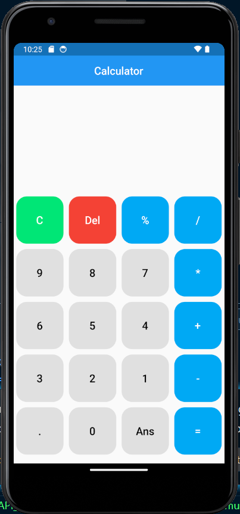
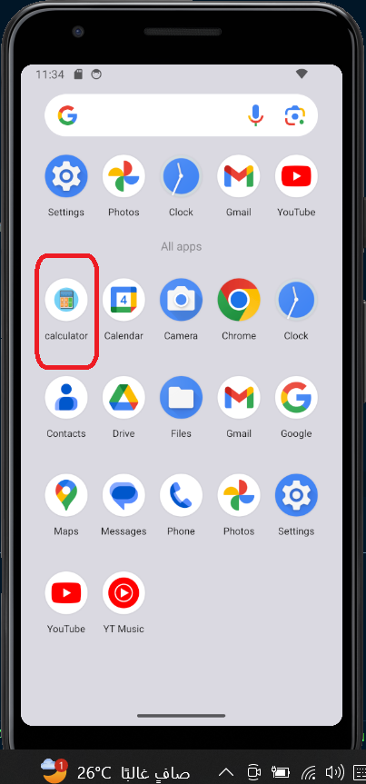

# Calculator
> An Android application of a basic calculator by Flutter designed by Khalid Salman

## Prerequisites

- Install Android Studio :
> From : [Android Studio](https://developer.android.com/studio)

## Screenshots
| Splash screen | Main interface |
| :---: | :---: |
|  |  |

| Division by 0 | The division by 0 is impossible|
| :---: | :---: |
|  |  |

| set App name & icon| 
| :---: | :---: |
|  | 

## Contributing

Contributions are what make the open source community such an amazing place to be learn, inspire, and create. Any contributions you make are **greatly appreciated**.

1. Fork the Project
2. Create your Feature Branch (`git checkout -b feature/AmazingFeature`)
3. Commit your Changes (`git commit -m 'Add some AmazingFeature'`)
4. Push to the Branch (`git push origin feature/AmazingFeature`)
5. Open a Pull Request

## License
[MIT License](https://choosealicense.com/licenses/mit/)
